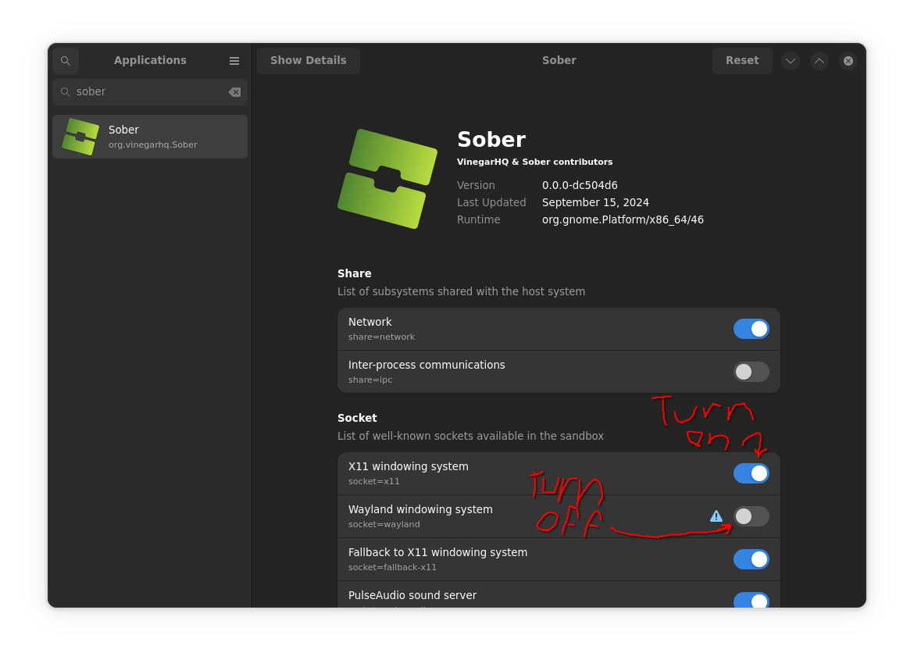

# FAQ (Frequently Asked Questions)
<hr>

## Q: Why Does this exist?
A: Because people on Linux still want to be able to play Roblox easily.

## Q: What is the minimum hardware needed?
In order to run Sober you need:
* CPU: Anything with SSE 4.2 or higher (CPUs from 2013+ should be fine)
* RAM: 4 GB, although it might run with less
* GPU: Vulkan capable graphics card, check "Q: Is the [GPU here] compatible?" for more info*
* Storage: 1-2 GB

<p class="tiny">[*] Vulkan 1.3 is required for "Future" graphics.<p>

## Q: Is the [GPU here] compatible?
A: If it was made in the last 8 years or so and has Vulkan support either in Mesa or Nvidia drivers, then yes. If you're not sure, check [GPUInfo](https://vulkan.gpuinfo.org/) and search your graphics card. If it doesn't support Vulkan, you can try the `--opengl` argument when launching Sober to force OpenGL. If it still doesn't work, you're out of luck.


## Q: I can't log in to Roblox!
A: If it didn't say explicitly you have a wrong password or something like that, reopen Sober and check if it logged you in. If that didn't work, try **"Login with Another Device"** on the login page.

## Q: Studio suport?
A: Roblox does not have Studio for Android. Use [Vinegar](https://vinegarhq.org/) for Roblox Studio, which uses the Windows version of Roblox Studio with Wine.

## Q: Why is Sober closed source?
A: When the development team was making Sober, they wanted to ensure it wouldn't meet the same fate as Vinegar (being blocked). They recommended to make Sober closed source, to ensure no Exploit developers abuse it. Sadly, this is a necessary measure to ensure the continued existence of Roblox on Linux. On the bright side, this ensures that Sober will not be blocked in the long term, if no exploits are made for it, which the dev team will ensure.

## Q: Roblox is crashing after around 5-10 minutes in game!
A: There are various issues that could cause this. Mostly, if you're on Wayland it's because Wayland support isn't great at the moment so you'll want make Sober use XWayland. To do this, you can simply run ```flatpak override --user --socket=x11 --nosocket=wayland org.vinegarhq.Sober```. Alternatively, if you prefer a GUI for managing flatpak permissions, you can use [Flatseal](https://flathub.org/apps/com.github.tchx84.Flatseal). And if you're on X11, don't know how to help you.



## Q: ARM64 support?
A: Maybe eventually, but right now there are too many issues to deal with to add support right now.
